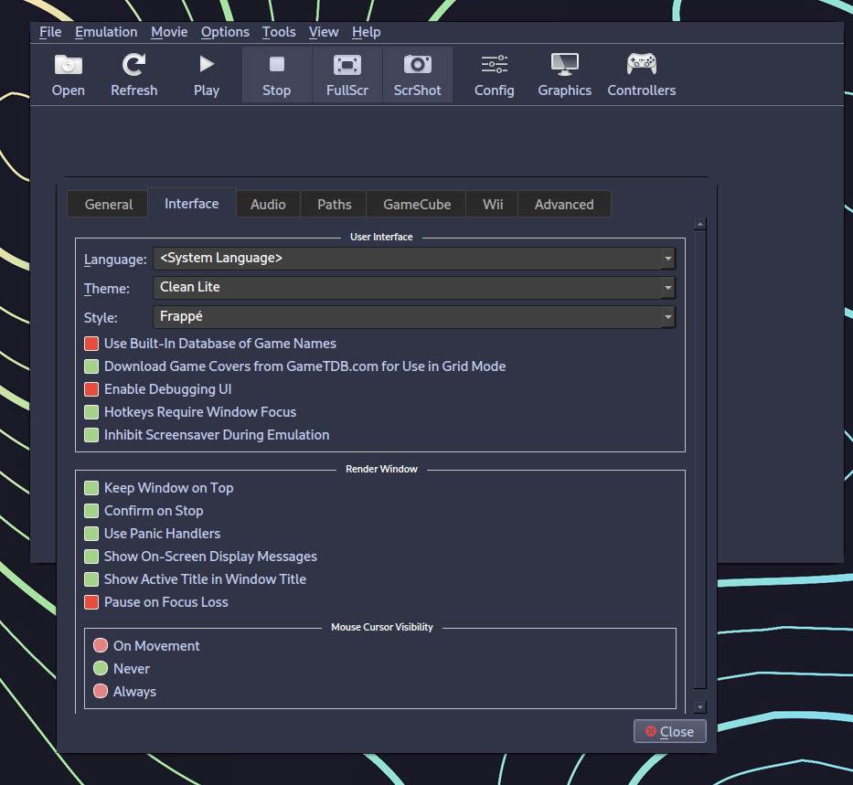

# Cattpuccin Themes for Dolphin Emulator! 
*(Note this also works with PCSX2)*
Have you noticed the lack of nice looking themes for dolphin? I know I have!

To help with this lack of theming for such an amazing program I decided to theme it myself using the Catppuccin palette!

Got any other Palettes you'd like to see dolphin in? 
Join my discord and suggest them :D 
https://discord.gg/YMgjJA8d

:warning: **Warning:** Latte is not finished! I will release it when it is :)

# How do I use this? 

It's super simple! just a drag and drop into the location listed below! 

:bulb: **Tip:** **For Mac OS**
```Library/ApplicationSupport/Dolphin/Styles```

:bulb: **Tip:**  **For Windows**
```AppData/Roaming/Dolphin Emulator/Styles```

:bulb: **Tip:** **For Linux**
```/home/(username)/./local/share/dolphin-emu/styles```

Alternatively, if you are having trouble locating your dolphin folder then you can click on the 'Config' Button inside of dolphin then go to paths, Inside of paths you can see the location of the dolphin folder at the bottom of the tab, from that you can change the end directory to /Styles and boom! you're ready to set your theme! 

   


# How do I set the theme? 

To set the theme all you need to change is Style inside of the interface option in Config/Settings! 


# Sooooo... How do they look?

Heres the theme! (Macchiato -> Mocha -> Frappé)




